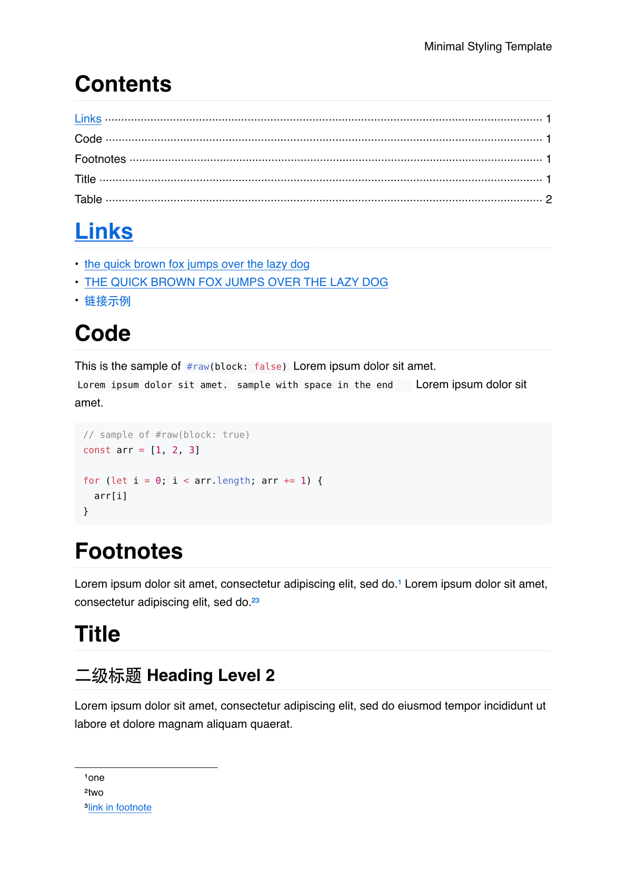

# Introduction

Minimal styling to make typst look like the preview of github markdown[^1][^2].

> 🎯 My purpose is not to replicate github markdown styling completely. Instead, just make me do not case too much about forming a good styling while taking notes in most cases.



# How to use
install [`just`](https://github.com/casey/just)

run the following setup steps:
```sh
git clone https://github.com/icyzeroice/typst-template-minimal-styling
cd typst-template-minimal-styling
just sync
```

then, use the local typst package like this:
```typst
#import "@local/minimal-styling:0.1.0": template_minimal_styling
#show: template_minimal_styling
```

# TODOs

- [x] text
- [x] headings
- [x] code
- [x] links
- [ ] footnotes
- [ ] table

# Related works

- [`coldy`](https://typst.app/universe/package/codly) : more styling with code
- [`octique`](https://typst.app/universe/package/octique) : github handcrafted icons
- [`note-me`](https://typst.app/universe/package/note-me) : github-style alert

# Footnotes

[^1]: [Markdown Cheatsheet · adam-p/markdown-here Wiki](https://github.com/adam-p/markdown-here/wiki/Markdown-Cheatsheet)

[^2]: [Basic writing and formatting syntax - GitHub Docs](https://docs.github.com/en/get-started/writing-on-github/getting-started-with-writing-and-formatting-on-github/basic-writing-and-formatting-syntax)
